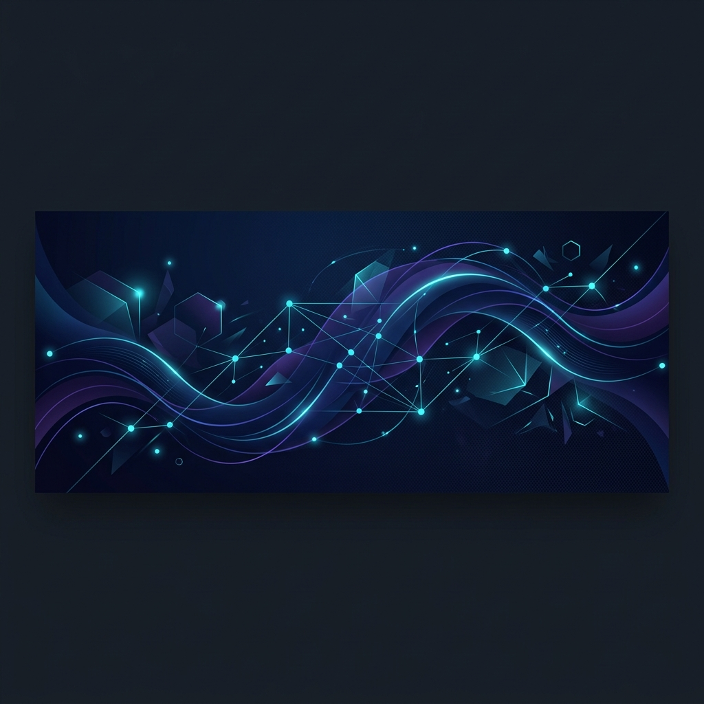

  <!-- Premium Header Banner -->
  
  
    
  
  <h1>👋 Hello, I'm Aiyan Ali Lone</h1>
  
<strong>Full-Stack Software Engineer & EdTech Innovator</strong>

  
  
Building high-performance applications with modern web technologies, real-time communication protocols, and interactive learning tools.

  <!-- Unified, Premium Contact Badges -->
  

    
    
    
  

### 🛠️ Tech Stack & Ecosystem

  <strong>Languages:</strong> 
  
  
   
  <strong>Frontend & Apps:</strong> 
  
  
  
  
   
  <strong>Backend & Realtime:</strong> 
  
  
  
   
  <strong>DevOps & Tools:</strong> 
  
  
  

### 🚀 Featured Open Source Projects
*If you find any of these tools useful, dropping a ⭐ on the repository means a lot!*

#### 🎥 [Separa](https://github.com/loneaiyan01/Separa)
> Gender-segregated video conferencing application built with LiveKit for secure, highly structured real-time video communication.
> `TypeScript` · `LiveKit` · `React` · `WebRTC`

#### 🕌 [IslamicDashboard](https://github.com/loneaiyan01/IslamicDashboard)
> A comprehensive dashboard interface featuring prayer times, Quranic displays, and interactive utilities for daily use.
> `TypeScript` · `Next.js` · `TailwindCSS`

#### 📖 [QuranPro1](https://github.com/loneaiyan01/QuranPro1)
> An interactive learning and revision ecosystem engineered to help users track memorization goals and review milestones.
> `TypeScript` · `React` · `EdTech`

#### 🧠 [NeuralDB](https://github.com/loneaiyan01/NeuralDB)
> A specialized database layer optimized for storing, managing, and indexing model configurations, states, or weights.
> `TypeScript` · `Database` · `Node.js`

#### 📝 [Taleeb Quiz](https://github.com/loneaiyan01/Taleeb-Quiz)
> Interactive online assessment tool tailored for educational institutes to evaluate student knowledge dynamically.
> `TypeScript` · `React` · `E-Learning`

#### 📹 [SubVideo](https://github.com/loneaiyan01/SubVideo)
> Video processing wrapper and layout engine built to overlay complex dynamic subtitles and manage interactive video layers.
> `TypeScript` · `Media Processing`

### 📊 Performance & Commit Metrics

  
  

